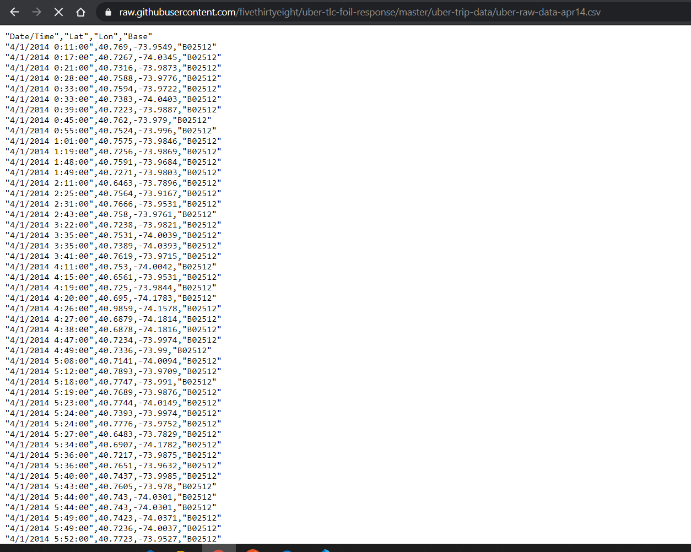
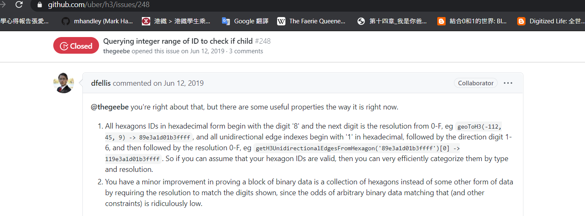

# Sunken Treasure

## Challenge Description

We think Blathers might be looking for treasure in the Pacific Ocean not too far from an island. The only data we were able to find about his travel were these logs we pulled from his Uber app. Maybe you can make some sense of them?

Note: the flag format is slightly different in this challenge

## Solution
We were given the following log:

```
8a5d15d06897fff
8a5d15d068b7fff
8a5d15d0699ffff
8a5d15d06987fff
8a5d15d069b7fff
8a5d15d3165ffff
8a5d15d31647fff
8a5d15d31667fff
8a5d15d3174ffff
8a5d15d3176ffff
8a5d15d31397fff
8a5d15d313b7fff
......
```

The description hinted that this is a log related to Uber. The first thing that came to mind is that this might be an Uber App log and each line represents a location. By Googling "Uber app reverse engineering", we found several posts but they all seemed to be irrelevant.

https://github.com/cartermc24/UBERPointerizer

http://jasonarkens17.github.io/jekyll/update/2016/08/29/Uber.html

https://github.com/tamnil/ubering

Later, we found the following:

[Uber TLC Foil Response](https://github.com/fivethirtyeight/uber-tlc-foil-response)


This suggested that the provided data are not simply location tracking data from a Uber trip. At this point, we got stuck and tried to search using random keywords. Googling "15 digit hex uber" gave us the following issue:


[Uber H3 Index Issue](https://github.com/uber/h3/issues/248)


With this issue, we were able to identify the source of the log -- Uber's h3 repository. Fortunately, the h3 repository can convert these data into longitudes and latitudes. Thus, we simply built the repository and converted the log using the following script:

```python
import os
with open('log') as f:
    original = f.read().split('\n')[:-1]
converted = [os.popen('./h3/bin/h3ToGeo --index ' + i).read()[:-1].replace(' ',',') for i in original]
with open('longlat.txt','w+') as f:
    f.write(',blue,marker\n'.join(converted))
```

We then aquired a list of coordinates. Plotting them using [this tool](https://mobisoftinfotech.com/tools/plot-multiple-points-on-map/) gave us:


Flag: `uiuctf[H3_iZ_very_HEX]`